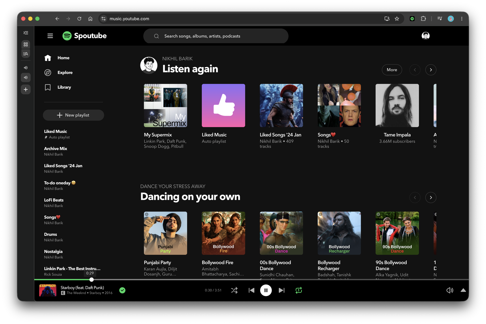

<h1 align="center">🎧 Spoutube</h1>

<p align="center">
  <b>Make YouTube Music look exactly like Spotify.</b><br/>
  A Manifest V3 Chrome extension that reskins <code>music.youtube.com</code> into a pixel-close clone of Spotify's desktop web player — sidebar, cards, now-playing bar, queue, typography, colors, the works.
</p>

<p align="center">
  
</p>

<p align="center">
  <i>That's YouTube Music. Not Spotify.</i>
</p>

---

## ✨ What it does

Spoutube injects a single, toggleable stylesheet (plus a light content script) that transforms YouTube Music's UI to match Spotify's:

- **🎨 Full Spotify skin** — `#121212` panels on a pure-black shell, Spotify green (`#1ed760`), rounded floating content panel, and Spotify's exact color tokens.
- **🔤 Circular typography** — uses Spotify's *Circular* font when available (drop your licensed files into `fonts/`), with a close geometric fallback.
- **🟢 Spotify player bar** — centered transport cluster (`shuffle · prev · ▶ · next · repeat`), solid white play button, green-when-active shuffle/repeat, and a green "added" check in place of the thumbs-up.
- **📚 Reskinned sidebar & cards** — Spotify's "Your Library" look, album cards with the signature green hover-play button, and Spotify-style track rows.
- **🏷️ "Spoutube" wordmark** — Spotify's green glyph, rebranded.
- **🔀 On/off toggle** — flip the whole reskin from the toolbar popup. No backend, no tracking, content-script only.

## 🚀 Install (unpacked)

1. Clone or download this repo.
2. Open `chrome://extensions`.
3. Enable **Developer mode** (top-right).
4. Click **Load unpacked** and select the `Spoutube` folder.
5. Open **[music.youtube.com](https://music.youtube.com)** — the reskin applies automatically.
6. Click the **Spoutube** toolbar icon to toggle it on/off.

> **Tip:** After changing the code, hit the ↻ icon on the extension card in `chrome://extensions`, then hard-reload the tab (`Cmd/Ctrl + Shift + R`).

## 🔤 Fonts (optional, for pixel-perfect type)

Spotify's *Circular* font is proprietary and **not** bundled here. If you own a license, drop these into `fonts/` and reload:

```
fonts/CircularSpUI-Book.woff2     → weight 400
fonts/CircularSpUI-Medium.woff2   → weight 500
fonts/CircularSpUI-Bold.woff2     → weight 700
```

Without them, Spoutube falls back to Avenir Next / Montserrat / system fonts.

## 🧩 How it works

| File | Role |
|------|------|
| `manifest.json` | MV3 manifest — injects the content script + CSS on `music.youtube.com` |
| `src/spotify.css` | The reskin. Every rule scoped under `html.spoutube-enabled` so the toggle is instant |
| `src/content.js` | Adds/removes the root class, injects the wordmark, and restructures the player-bar controls into Spotify's layout |
| `popup/` | Toolbar popup with the on/off switch |
| `icons/` | Extension icons |

The design philosophy: **do it in CSS wherever possible** (robust against YouTube's frequent DOM changes), and reach for the content script only for structural moves CSS can't express (like centering the transport controls).

## ⚠️ Notes

- Not affiliated with, endorsed by, or connected to Spotify or YouTube. It's a personal, cosmetic reskin for fun.
- "Spotify", "YouTube Music", and *Circular* are trademarks/property of their respective owners.
- YouTube Music ships DOM changes often; if something looks off after a YouTube update, it's likely a selector that needs a nudge.

## 📝 License

MIT — do whatever you want. See [`LICENSE`](LICENSE) if present.

---

<p align="center"><sub>Built with a lot of screenshot-diffing. 🎵</sub></p>
